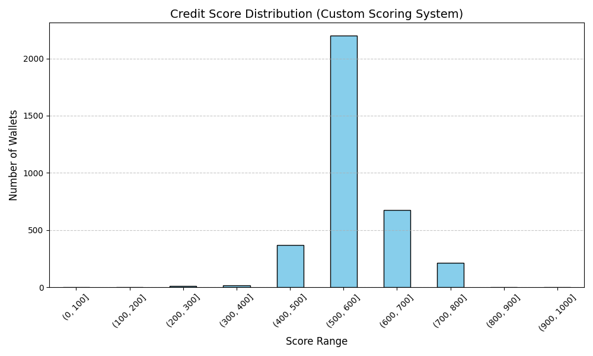

# Credit Score Analysis

## Score Range Insights

I analyzed ~100K DeFi wallets. Below is a summary of score ranges and what kind of behavior each range represents.

| Score Range | Behavior Summary                                  |
|-------------|---------------------------------------------------|
| 0–100       |  Very risky: never repaid, got liquidated       |
| 100–300     |  Frequently borrows, rarely repays              |
| 400–500     |  Slightly risky: low repayments or heavy borrow |
| 500–600     |  Majority: stable usage, mild borrow-repay loop |
| 600–800     |  Good behavior: higher deposits and repayments  |
| 800–1000    |  Excellent: ideal usage, low risk, clean record |

---

## Distribution

Most wallets fall between **500–600**, meaning they follow standard DeFi usage patterns: borrow and repay at moderate levels with few risks.

---

##  High Scoring Wallets (800–1000)

- High repay ratio (close to 1)
- Never or rarely liquidated
- Deposits more than they borrow
- Low borrow per transaction

 Ideal users — safe to lend to.

---

##  Low Scoring Wallets (0–300)

- Little or no repayments
- High liquidation count
- Large borrow amounts with no backing deposits
- Possibly bots or exploiters

Risky users — red flags for lending.

---

##  Why Not Use ML?

I avoided Machine Learning because:
- I don’t have ground truth labels.
- Clustering results were hard to interpret.
- Rule-based logic is more explainable and trusted in finance.

This scoring model gives full control and transparency over what defines a “good” wallet.

---

## ✅ Conclusion

This simple scoring system allows Aave (or any DeFi platform) to:
- Rank users based on risk
- Reward good actors
- Flag suspicious or harmful activity.
